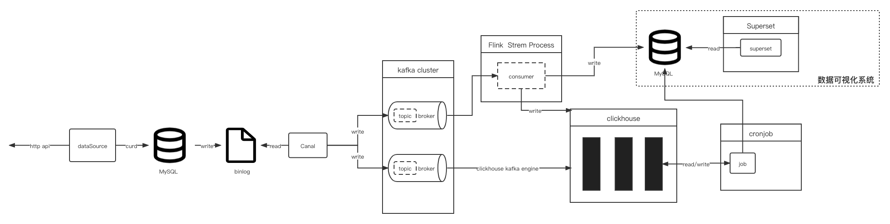

# Introduce
bigDataMVP 意在基于股市（A股）大数据打造的一个OLAP平台


## Technical Architecture


## Doing
```
1、flink 实时ETL 
2、clickhouse 数据仓库
3、clickhouse 定时批量计算
4、superset 数据可视化
```

## To do
1、股票变化趋势计算
2、基于机器学习集成学习模型的股票涨跌预测
